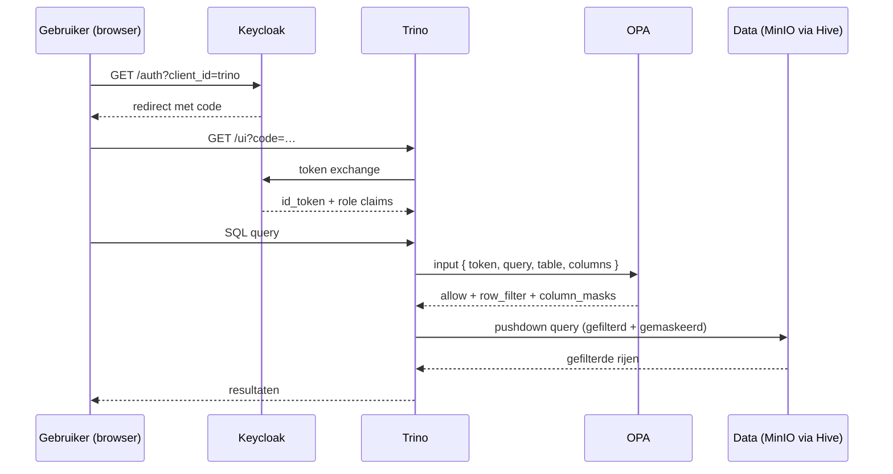

<!-- Auto-generated door scripts/docs_gen.py uit portal/src/data/components.ts.
     Wijzigingen handmatig vervallen bij de volgende CI-build — bewerk de TS-bron. -->

# Identiteit & autorisatie

Toegang is geen kwestie van losse user-accounts per service — alle componenten
delegeren authenticatie naar **Keycloak** (OIDC) en autorisatie op queries
naar **Open Policy Agent (OPA)**.

## Auth-flow



## Identity provider — Keycloak

- **Realm:** `uwv` in [`infrastructure/helm/keycloak/realm-uwv.json`](https://github.com/fresh-minds/FreshStackableDataPlatform/blob/main/infrastructure/helm/keycloak/realm-uwv.json)
- **Mock-rollen** in deze referentie:
    - Business: `wia_beoordelaar`, `ww_handhaver`, `wajong_arbeidsdeskundige`,
      `crm_medewerker`, `fez_analist`, `smz_planner`, `proactief_dienstverlener`,
      `researcher`
    - Tech: `data_steward`, `data_engineer`, `platform_admin`
- **MFA:** TOTP verplicht voor tech-rollen; aanbevolen voor business-rollen
  (configureerbaar in realm-export).
- **Token-claim** `groups` bevat de Keycloak-groepen → mapt naar OPA-rollen.

Elk component (Trino, Superset, Airflow, NiFi, OpenMetadata) configureert
Keycloak via een Stackable `AuthenticationClass` — zie
[`platform/02-authentication/`](https://github.com/fresh-minds/FreshStackableDataPlatform/tree/main/platform/02-authentication).

## Authorisatie — OPA + Rego

Trino delegeert elke query naar OPA via het `opa-authorizer`-plugin:

```
Trino-query ──► OPA bundle (uit ConfigMap) ──► allow/deny + row filters + column masks
```

De Rego-policies in [`opa-policies-src/`](https://github.com/fresh-minds/FreshStackableDataPlatform/tree/main/opa-policies-src):

| Policy | Doel |
|---|---|
| `trino-base.rego` | OIDC token-validatie, role-mapping |
| `trino-data-access.rego` | Catalog/schema/table-toegang per rol |
| `trino-doelbinding.rego` | Doelbinding (purpose) afdwingen op gold-tabellen |
| `trino-row-filters.rego` | Rij-filters per rol (bijv. WW-handhaver ziet alleen WW-claims) |
| `trino-column-masks.rego` | Kolom-maskering (PII, gezondheid → hash of `***`) |
| `trino-uwv-roles.rego` | UWV-rol-definities (single source) |

Build van de bundle: `scripts/build-opa-bundle.sh`, geïntegreerd in
`make deploy-platform`.

!!! tip "Doelbinding eerst"
    Bij elke query controleert OPA of er een **geldig doel** is meegegeven
    (bijv. `uitkering`, `handhaving`, `onderzoek`). Zonder doel: deny.
    Doelbinding is harder dan rol — een WIA-beoordelaar zonder doel
    `uitkering` krijgt ook in zijn eigen mart geen data.

## Zie ook

- [ADR-0003 · OPA als Trino-authz](../adr/0003-opa-as-trino-authz.md)
- [ADR-0008 · Self-service data-access](../adr/0008-self-service-data-access.md)
- [Toegang aanvragen (handleiding)](../access-request-guide.md)
- [Compliance-mapping § AVG](../compliance-mapping.md)
