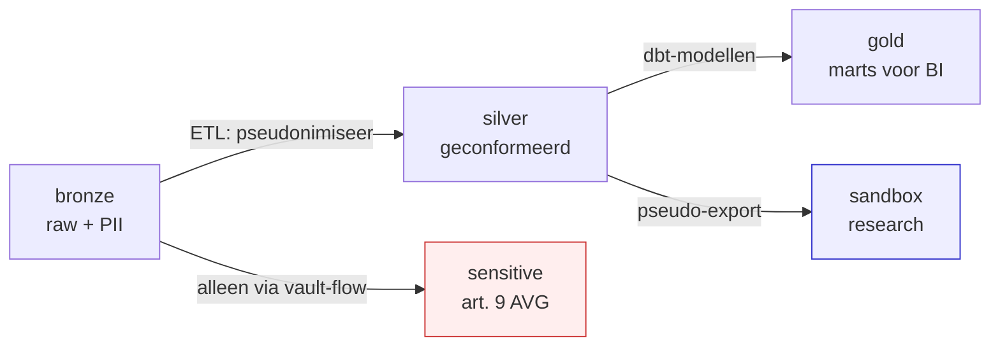

<!-- Auto-generated door scripts/docs_gen.py uit portal/src/data/components.ts.
     Wijzigingen handmatig vervallen bij de volgende CI-build — bewerk de TS-bron. -->

# Datazones

Vier MinIO-buckets, elk met eigen Trino-catalog, plus een aparte vault voor
bijzondere persoonsgegevens (art. 9 AVG). De zone-naam in de portal en in
de OPA-policies zijn 1-op-1.

## Overzicht

| Catalog | Bucket | Inhoud | Toegang (default) |
|---|---|---|---|
| `bronze` | `uwv-bronze` | Onveranderbare brondata (incl. raw PII) | data-engineers (JIT) |
| `silver` | `uwv-silver` | Geconformeerd, gepseudonimiseerd waar mogelijk | analisten + engineers |
| `gold` | `uwv-gold` | CGM-conforme business products | domein-rollen via RBAC |
| `sensitive` | `uwv-sensitive` | Bijzondere persoonsgegevens (art. 9 AVG, medisch) | strikt; 4-eyes principe |
| `sandbox` | `uwv-sandbox` | Gepseudonimiseerd — voor researchers | researcher (read-only) |

## Toegangsstrategie

OPA-policies zijn **format-agnostisch**: ze kijken naar
`catalog.schema.table`- en kolomnamen, niet naar het onderliggende
bestandsformaat. Switching tussen Delta en Iceberg laat de policies
onveranderd (zie [ADR-0002](../adr/0002-iceberg-vs-delta.md)).

## Wat zie je per rol?

Dit volgt 1-op-1 de rol-handleidingen:

- **WIA-beoordelaar / Wajong-arbeidsdeskundige / etc.** → primair `gold`,
  beperkt `silver` (eigen domein). Geen `bronze`.
- **Data-engineer** → `bronze` (JIT), `silver`, `gold`, `sensitive` (alleen
  via break-glass).
- **Data-steward** → read-only over alle zones (governance).
- **Researcher** → uitsluitend `sandbox`.
- **Platform-admin** → alles, maar elke query wordt audit-logged (zie
  [Runbook](../runbook.md#audit-trail)).

Welke kolommen je in een gold-mart precies ziet hangt af van de OPA-policies
in [`opa-policies-src/`](https://github.com/fresh-minds/FreshStackableDataPlatform/tree/main/opa-policies-src).
Zie [Identiteit & autorisatie](auth.md) voor de policy-flow.
