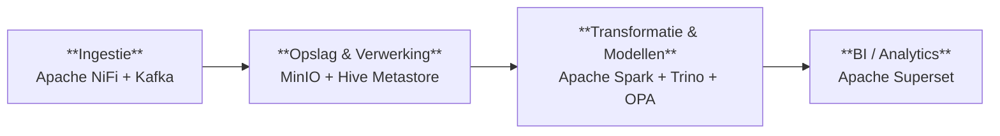

<!-- Auto-generated door scripts/docs_gen.py uit portal/src/data/components.ts.
     Wijzigingen handmatig vervallen bij de volgende CI-build — bewerk de TS-bron. -->

# Architectuur

Het platform is opgebouwd als een **keten van lagen** — data komt binnen
(ingestie), wordt opgeslagen (lakehouse), bewerkt en gemodelleerd
(transformatie) en uiteindelijk geconsumeerd in dashboards en data-producten.
Daaroverheen liggen vijf cross-cutting lanen — **identity**, **discovery**,
**pipeline-orkestratie**, **observability** en **agents** — die overal raken.

## Dataflow (high-level)

Auth/authz en observability raken alle componenten — zie
[Identiteit & autorisatie](auth.md) en [Operations / Runbook](../runbook.md).

## Mapping op de UWV-referentiearchitectuur

| Laag in referentie-arch. | Component in deze repo |
|---|---|
| Bronnen | `data-generation/` — synthetische generators voor Polisadm/WW/WIA/Wajong/CRM/FEZ |
| Ingestie & integratie | `platform/07-nifi/` (NiFi) + `platform/06-kafka/` (Kafka) + `nifi-flows/templates/` |
| Opslag (lakehouse, medallion) | MinIO (`platform/03-storage/`) + Delta-tabellen + `platform/05-hive-metastore/` |
| Processing & ML | `platform/08-spark/apps/` (PySpark via SparkApplication) + `dbt/` (Trino-side transforms) |
| Semantische laag | dbt-marts (`dbt/models/marts/uc0x_*/`) + Trino views (`gold` catalog) |
| Consumptie | `platform/12-superset/` (BI) + Trino REST/JDBC voor toekomstige API-laag |
| IAM | Keycloak (`infrastructure/helm/keycloak/`) + Stackable AuthenticationClass (`platform/02-authentication/`) |
| Authorisatie | `platform/10-opa/` + `opa-policies-src/` (Rego) |
| Catalog / lineage / DQ | OpenMetadata (`infrastructure/helm/openmetadata/`) + `platform/13-openmetadata-config/` |
| Observability | Vector (Stackable) + Prometheus (`infrastructure/helm/prometheus-stack/`) + OpenSearch (gedeeld) |
| Secrets / TLS | cert-manager + Stackable secret-operator |

## Componenten per laag

### Ingestie { #ingestion }

Data binnenhalen en op een event-bus zetten.

| Component | Verantwoordelijkheid | Doel |
|---|---|---|
| [Apache NiFi](componenten.md#nifi) | Visuele ingestion-flows — bronsystemen → Kafka. | Data uit UWV-bronsystemen ophalen en in het platform binnenbrengen. |
| [Kafka](componenten.md#kafka) | Event-bus tussen NiFi-ingestion en Spark Structured Streaming. | Data-events bufferen en doorzetten naar verwerking. Schaalbare doorvoer. |

### Opslag & Verwerking { #storage }

Lakehouse met zones en een tabel-catalog.

| Component | Verantwoordelijkheid | Doel |
|---|---|---|
| [MinIO](componenten.md#minio) | S3-compatible object store met buckets bronze/silver/gold/sensitive. | Het lakehouse waar alle data fysiek staat — gelaagd in zones met aparte toegangsregels. |
| [Hive Metastore](componenten.md#hive) | Catalog backend — houdt tabel-schemas en partities bij voor Trino en Spark. | Vertaalt bestanden in MinIO naar tabellen met kolommen en types. |

### Transformatie & Modellen { #transformation }

Opschonen, joinen, modelleren — met policy-checks per query.

| Component | Verantwoordelijkheid | Doel |
|---|---|---|
| [Apache Spark](componenten.md#spark) | Streaming + batch jobs die Delta-tabellen op MinIO schrijven. | Zware data-bewerkingen — opschonen, joinen, aggregeren — in stream of batch. |
| [Trino](componenten.md#trino) | SQL query-engine over Delta-lakehouse, met OPA-authorisatie. | Snel SQL draaien over de hele lakehouse — voor dbt-modellen én eindgebruikers. |
| [OPA](componenten.md#opa) | Open Policy Agent — beslist per Trino-query wat een rol mag zien (rij-filters, kolom-maskers, doelbinding). | Doelbinding, rij-filters en kolom-maskering afdwingen op iedere query. |

### BI / Analytics { #consumption }

Eindgebruikers consumeren via dashboards en SQL.

| Component | Verantwoordelijkheid | Doel |
|---|---|---|
| [Apache Superset](componenten.md#superset) | Dashboards en SQL Lab — primaire UI voor de meeste eindgebruikers. | Dashboards en ad-hoc analyse voor business-rollen — zonder SQL hoeven kennen. |

### Data Discovery { #discovery }

Catalog, lineage en data-kwaliteit — wat hebben we eigenlijk?

| Component | Verantwoordelijkheid | Doel |
|---|---|---|
| [OpenMetadata](componenten.md#openmetadata) | Catalog, glossary, lineage, data-quality. | Wat hebben we, wie is eigenaar, hoe is het opgebouwd, en is het op orde? |
| [dbt docs](componenten.md#dbt-docs) | Modellen, tests, sources en lineage van de dbt-projectdefinities. | Wat doen onze dbt-modellen, welke tests draaien er, en hoe vloeit data van staging naar marts? |

### Pipeline-orkestratie { #pipeline }

Wat draait wanneer, in welke volgorde, met welke afhankelijkheid.

| Component | Verantwoordelijkheid | Doel |
|---|---|---|
| [Apache Airflow](componenten.md#airflow) | DAG-orchestratie voor batch-jobs en dbt-runs. | Plant en bewaakt alle scheduled jobs — wat draait wanneer, in welke volgorde. |

### Observability { #observability }

Metrics, logs en alerts om de gezondheid van het platform te zien.

| Component | Verantwoordelijkheid | Doel |
|---|---|---|
| [Prometheus](componenten.md#prometheus) | Metrics + alerts; voedt de status-badges in deze portal. | Metrics verzamelen en alerteren als iets stuk dreigt te gaan. |
| [OpenSearch](componenten.md#opensearch) | Logs (Vector) + search-backend voor OpenMetadata. | Logs centraal doorzoekbaar maken — debugging en audit-trail. |

### Identiteit & Toegang { #identity }

SSO regelt wie wat mag — elk onderdeel checkt het token.

| Component | Verantwoordelijkheid | Doel |
|---|---|---|
| [Keycloak](componenten.md#keycloak) | OIDC-identity provider — single sign-on en MFA voor alle componenten. | Eén keer inloggen, overal toegang volgens je rol. MFA en audit-log centraal. |

### Agents & AI-tooling { #agents }

Coördinatie van coding agents (Multica) en gerelateerde dev-loop tooling.

| Component | Verantwoordelijkheid | Doel |
|---|---|---|
| [Multica](componenten.md#multica) | Coördinatie van coding agents (Claude Code, Codex, Copilot CLI, …) — taken, voortgang, skills. | Taken toewijzen aan coding agents; voortgang volgen. Agents draaien op je laptop. |

## Verder lezen

- [Componenten in detail](componenten.md) — per component een eigen sectie
- [Datazones](datazones.md) — medallion + sensitive uitleg
- [Identiteit & autorisatie](auth.md) — Keycloak + OPA
- [Tabel-formaat abstractie](tabel-formaat.md) — Delta vs Iceberg
- [Naming conventions](naming.md)
- [Originele referentie-architectuur](referentie.md) — bron-document
