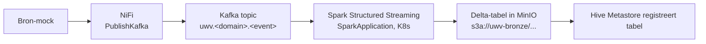

<!-- Auto-generated door scripts/docs_gen.py uit portal/src/data/components.ts.
     Wijzigingen handmatig vervallen bij de volgende CI-build — bewerk de TS-bron. -->

# Tabel-formaat abstractie

Eén centrale variabele bepaalt of het hele platform op Delta of Iceberg
draait. Geen hardcoded format-keuze in dbt-models, Spark-jobs, Trino-catalogs
of NiFi-flows.

```yaml
# platform-config.yaml
platform:
  table_format: delta   # delta | iceberg
```

## Wie leest die variabele?

| Component | Hoe |
|---|---|
| **Trino-catalogs** | Templates onder `platform/09-trino/catalogs/*.yaml.tmpl` worden gerenderd door `scripts/render-trino-catalogs.sh` op basis van `table_format`. Connector wordt `delta-lake` of `iceberg`. |
| **dbt** | `dbt_project.yml` zet `vars: table_format: "{{ env_var('TABLE_FORMAT', 'delta') }}"`. Macro `table_format_properties()` levert de juiste `properties{}` per model. |
| **Spark** | Env var `TABLE_FORMAT` op `SparkApplication`. Helper `spark-jobs/lib/lakehouse_io.py` schakelt `write_iceberg()` vs `write_delta()`. |
| **NiFi** | Twee templates onder `nifi-flows/templates/{iceberg,delta}/`. Per default deployen we de Delta-variant (= NiFi → Kafka, en Spark schrijft Delta). |
| **Airflow** | DAGs lezen `Variable.get("TABLE_FORMAT")`. Maintenance-DAG kiest `OPTIMIZE`/`VACUUM` (Delta) of `expire_snapshots`/`rewrite_data_files` (Iceberg). |

**Geen** hardcoded `delta` of `iceberg` buiten deze plekken.

## Waarom deze abstractie?

Zie [ADR-0002 · Iceberg vs Delta](../adr/0002-iceberg-vs-delta.md) voor de
afweging en [ADR-0006 · Delta gekozen voor deze implementatie](../adr/0006-delta-chosen-for-this-implementation.md)
voor waarom deze referentie-implementatie Delta default.

## Ingestion-pad bij Delta (afwijking van Iceberg-demo)

Stackable's referentie-demo `data-lakehouse-iceberg-trino-spark` gebruikt
NiFi's native `PutIceberg`-processor. Voor **Delta is er geen native NiFi-
processor**. Daarom wordt voor de Delta-route alle bron-data via NiFi naar
**Kafka** geschreven; Spark Structured Streaming consumeert Kafka en schrijft
naar Delta op MinIO.



Iceberg-pad (toekomstig of switch-back): NiFi's `PutIceberg` schrijft direct
naar bronze; Spark blijft beschikbaar voor silver/gold-transformaties.
