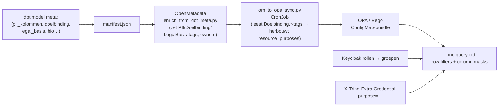
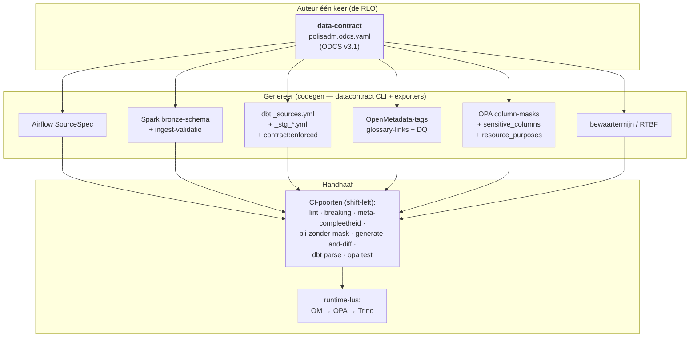
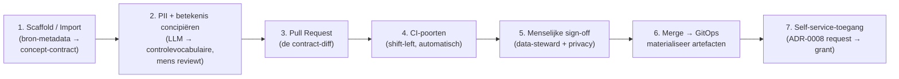

# Exploration: RLO als data-contract — record layout voor het lakehouse

> **Status: design-memo** in een nog te creëren branch `feat/rlo-data-contract`.
> Voorgesteld als vervanging van het handmatige "record layout"-proces (RLO) —
> de per-bron ingevulde Excel die een nieuwe bron beschrijft vóór ingestie —
> door een **data-contract-as-code** dat het platform zelf leest en genereert.
>
> Promote naar **ADR-0012** zodra:
> - één bron end-to-end draait vanuit een ODCS-contract (SourceSpec + dbt +
>   OM-tags + OPA-mask gegenereerd, `generate-and-diff` groen);
> - de CI-poorten (`lint`, `breaking`, meta-compleetheid, `pii-zonder-mask`,
>   `generate-and-diff`) op één bron staan;
> - Data Office + Privacy de contract-velden (`doelbinding`, `legal_basis`,
>   `classification`) als bindend hebben bevestigd.

---

## TL;DR

Vandaag is een **RLO** (record layout) een handmatig Excel dat per bronsysteem
elk veld beschrijft — technische naam, datatype/lengte, PK, verplicht,
omschrijving, PII, vereiste maskering — als **ontwerp voor een Oracle-DWH-tabel**.
Dit platform is geen Oracle-DWH. Er is **geen doeltabel om te ontwerpen**: data
stroomt door een medallion (bronze → silver → gold) en autorisatie wordt
**op query-tijd** afgedwongen door OPA in Trino. De schaarse arbeid verschuift
van "typemapping" naar *betekenis, PII, rechtsgrond, doelbinding, bewaartermijn,
wie-mag-wat-en-waarvoor* — en die beslissingen moeten **code worden die draait**,
geen tekst in een cel.

**Voorstel:** maak per dataset **één gezaghebbend data-contract** in de
[**Open Data Contract Standard (ODCS) v3.1**](https://bitol.io) — óf als uitbreiding
van de bestaande `platform/11-airflow/sources/*.yml` SourceSpec, óf als
`*.odcs.yaml`-sibling — en **genereer** daaruit alle downstream-artefacten
(Airflow-SourceSpec, Spark-bronze-schema, dbt-modellen met `contract:enforced`,
OpenMetadata-tags, OPA-column-masks, bewaartermijn). Handhaaf shift-left in CI en
op query-tijd via de dbt-meta → OM → OPA → Trino-lus die dit platform **al** heeft.

De belangrijkste winst: één per-property-declaratie (`classification: pii` +
`maskingStrategy`) voedt **zowel** de OpenMetadata-ontdekkingstag **als** de
OPA-handhavingsmask — waarmee de huidige **twee losgekoppelde classificatie-stores**
(OM `PII.*`-tags vs. OPA die op kolomnaam matcht) worden gedicht.

Radicaal in **vorm** (Excel → contract-as-code, alles genereren), conservatief in
**leidingwerk** (de bestaande governance-lus en het CGM-glossarium blijven).

Concrete bijlagen in deze map:
- [`example-polisadm-ikv.odcs.yaml`](example-polisadm-ikv.odcs.yaml) — een compleet,
  gevalideerd ODCS v3.1-contract voor een echte dataset (`stg_polisadm_ikv`), met de
  oude RLO-Excel-kolommen erop gemapt.
- [`generated-from-contract.md`](generated-from-contract.md) — de zes downstream-artefacten
  die uit dat ene contract worden gegenereerd, inclusief de OPA-mask-kloof die dicht gaat.

---

## Context — de RLO van vandaag

Voor elke nieuwe bron vult een data-engineer een record layout in: een Excel met
één rij per attribuut en kolommen voor *Attribuut (technisch)*, *Datatype/formaat
(interface)*, lengte, *PK*, *Verplicht*, *Omschrijving*, een PII-classificatie en
*Vereiste maskering*. De RLO is een **ontwerpdocument voor een doeltabel**: hij
vertelt het warehouse-team welke `CREATE TABLE` te schrijven en hoe elk bronveld
naar een Oracle-type te mappen. Hij wordt één keer opgesteld, met de hand
gereviewd, en zijn feiten worden vervolgens **met de hand opnieuw geïmplementeerd**
in DDL, in ETL en in wat er aan governance-tooling is — per plek opnieuw.

## Waarom de Excel dit platform niet overleeft

Drie dingen veranderen waar de RLO *voor dient*:

1. **Er is geen doeltabel om te ontwerpen.** De fysieke layout is Delta/Parquet
   met schema-on-read en schema-evolutie (ADR-0002/0006); de "typemapping" die de
   Oracle-RLO domineerde is nu triviaal en grotendeels automatisch. Het waardevolle
   werk verschuift *omhoog*: wat betekent een veld, is het PII, wat is de
   rechtsgrond en doelbinding, hoe lang bewaren we het, wie mag het zien en waarvoor.

2. **Governance is uitvoerbaar, niet documentair.** Dit platform dwingt toegang af
   op query-tijd: OPA/Rego past **row filters en column masks** toe binnen Trino op
   basis van Keycloak-rollen en een *purpose*-header (`doelbinding`). Een
   maskeringsbesluit in een Excel-cel doet niets; op dit platform moet zo'n besluit
   eindigen als **beleid dat de engine uitvoert** — anders is het theater.

3. **Een spreadsheet kan geen build-input zijn.** Dit platform is GitOps: kustomize,
   dbt-project, CI-workflows, ConfigMaps. Het artefact dat een dataset beschrijft
   moet *in de repo* leven, diff-baar zijn, in CI gevalideerd worden en door
   generators *geconsumeerd* worden. Een `.xlsx` is niets daarvan.

De **essentie** van de RLO — *"een per-bron-declaratie van elk veld, zijn type,
betekenis, gevoeligheid en behandeling"* — is precies goed en het bewaren waard.
Zijn **vorm** (een handmatige Excel die mensen downstream natypen) is precies fout
voor dit platform. Het voorstel behoudt de essentie en keert de vorm om: de
declaratie wordt de **single source of truth die het platform leest**.

Dit is het industrie-patroon **"data contract as code" / "shift-left governance"**:
verplaats het contract naar het punt van productie, druk het uit in een
machine-leesbaar standaardformaat, en genereer + handhaaf alles downstream eruit.

## Wat het platform al heeft (en waar het versplinterd is)

Dit platform is hier ongewoon volwassen — het heeft in feite *al* besloten dat de
RLO code hoort te zijn. Het onopgeloste probleem: het contract ligt **verspreid
over zes oppervlakken die met de hand in overeenstemming gehouden moeten worden**,
en de governance-intentie is maar *deels* aan handhaving gekoppeld.

### De de-facto RLO leeft vandaag op zes plekken

| # | Oppervlak | Bestand(en) | Draagt |
|---|---|---|---|
| 1 | **Airflow SourceSpec** | `platform/11-airflow/sources/*.yml` (10 bronnen) | stream/bronze/silver-plaatsing, `governance:`-blok (legal_basis, doelbinding, bio, bewaartermijn, `pii_kolommen`, risk_tier), SLA. CSV-bronnen dragen ook een inline per-veld `schema:` (naam/type/required/min/max). |
| 2 | **dbt sources** | `dbt/models/staging/_sources.yml` | dupliceert governance-meta per bron |
| 3 | **dbt staging schema** | `dbt/models/staging/**/_stg_*.yml` | per-model `meta:`-blok (dezelfde governance-keys) + per-kolom tests |
| 4 | **OpenMetadata** | `platform/13-openmetadata-config/classifications-uwv.yaml`, `glossary-cgm.yaml` | ~50 tags in 7 classificaties; CGM-glossarium (~22 termen) |
| 5 | **OPA/Rego** | `opa-policies-src/trino/trino-column-masks.rego`, `.../data/uwv_role_mappings.json` | column masks **hardcoded op kolomnaam**; `sensitive_columns`; `resource_purposes` |
| 6 | **Transformatie** | `dbt/macros/pseudonymize.sql`, `stg_*.sql` | SHA-256-pseudonimisatie, met de hand toegepast in SQL |

Het **type en de lengte** van een veld — het hart van de oude RLO — leven vandaag
*uitsluitend* in de staging-SQL-cast (`cast(json_extract_scalar(...) as integer)` in
`stg_polisadm_ikv.sql`); ze staan in **geen enkel** contractbestand. En
`pii_kolommen` is een handmatige namenlijst op het model die, zoals we zien, de
maskering **niet** aanstuurt.

### De gesloten governance-lus bestaat al (dit is het goede deel)

Het platform draait al een echte dbt-meta → catalog → policy → engine-lus:



`om_to_opa_sync.py` beschrijft zijn eigen missie al: *"Sluit het lint dbt-meta →
enricher → OM → OPA → Trino-rij-/kolom-policy."* Het voorstel **houdt deze lus
intact** en voedt hem simpelweg vanuit het contract in plaats van vanuit
handmatige `meta:`.

### De kloven die het voorstel dicht

- **G1 — Type/lengte staan niet in het contract.** Ze leven alleen in de
  staging-SQL-cast. Het belangrijkste RLO-feit is nergens machine-leesbaar.
- **G2 — Twee losgekoppelde classificatie-stores.** OpenMetadata `PII.*`-tags zijn
  voor *ontdekking*; OPA-masks matchen op de *letterlijke kolomnaam*
  (`column_lower == "bsn"` in `trino-column-masks.rego`) plus een `sensitive_columns`-lijst,
  voor *handhaving*. Niets garandeert dat ze overeenkomen. Een nieuwe
  `sofinummer`-kolom krijgt geen mask.
- **G3 — `pii_kolommen` stuurt de maskering niet aan.** Het is een namenlijst voor
  CI-checks en OM; de OPA-mask wordt onafhankelijk geschreven. Een veld PII noemen
  en het daadwerkelijk maskeren zijn twee losse handelingen.
- **G4 — `apply_doelbinding_tag()` is een no-op-stub**, de meta-compleetheids-poort
  is een `# TODO fase 9`, en de voorgeschreven `test_sources_consistency.py`
  (genoemd in het commentaar van `persoon.yml`) **bestaat niet**. Consistentie
  wordt beweerd, niet gecontroleerd.
- **G5 — Duplicatie.** Het governance-blok is gekopieerd over SourceSpec (#1),
  `_sources.yml` (#2) en `_stg_*.yml` (#3). Drie kopieën, één waarheid, geen handhaving.
- **G6 — Handmatige pseudonimisatie.** `pseudonymize()` wordt met de hand in elk
  staging-model toegepast; niets koppelt "veld is PII" aan "veld is gepseudonimiseerd".

Alles hierboven is het argument *vóór* één gezaghebbend contract. Het platform
gelooft al in de lus; het mist alleen het ene bestand dat hem voedt.

## Voorstel — één contract, overal gegenereerd



Drie eigenschappen maken dit werkbaar, alle drie gangbare praktijk:

- **Single source of truth.** Het contract is het *enige* handgeschreven
  governance-bestand. Oppervlakken #1–#6 worden *projecties*. Dit is exact het
  ADR-0010-principe ("platform-config als single source") toegepast op het
  dataset-contract. Doodt G1, G3, G5, G6.
- **Codegen + generate-and-diff.** Een build-stap emitteert elk artefact; CI
  regenereert en faalt bij drift, zodat niemand een gegenereerd bestand met de hand
  uit de pas kan bewerken. De tooling bestaat: `datacontract-cli` exporteert ODCS
  naar dbt, Spark, SQL-DDL, SodaCL en Great Expectations; dbt's eigen
  `contract: {enforced: true}` preflight de vorm.
- **Eén classificatie → zowel ontdekking als handhaving.** Een per-property
  `classification: pii` + `maskingStrategy` genereert *zowel* de
  OpenMetadata-tag *als* de OPA-mask. Doodt G2 — de twee stores worden één.

Waarom **ODCS** specifiek: het is een open LF-AI-&-Data-standaard (v3.1.0) precies
hiervoor gebouwd — met native per-property `classification`, `criticalDataElement`,
`logicalTypeOptions` (lengte/precisie/pattern), quality, SLA, roles/teams, én
`customProperties` voor org-specifieke velden — zodat `doelbinding`/`legal_basis`/
`bewaartermijn` er schoon in passen zonder de standaard te buigen. Het heeft echte
tooling (datacontract-cli, OpenMetadata import/export). Een standaard adopteren
verslaat een bespoke YAML die alleen onze generators begrijpen.

## Het contract-schema (ODCS) — RLO-kolommen gemapt

De kolommen van de oude RLO mappen schoon op ODCS-properties. **Niets van waarde
uit de Excel gaat verloren** — het wordt alleen machine-leesbaar en getypeerd.

| Oude RLO-Excel-kolom | ODCS-locatie | Opmerking |
|---|---|---|
| *Attribuut (technisch)* | `property.name` / `physicalName` | het veld |
| *Datatype/formaat (interface)* | `property.logicalType` + `physicalType` | **G1 opgelost** — type nu in het contract |
| lengte / precisie / schaal | `property.logicalTypeOptions` (`maxLength`, `precision`, `scale`, `pattern`) | |
| *PK* | `property.primaryKey` + `primaryKeyPosition` | |
| *Verplicht* | `property.required` | |
| *Omschrijving* | `property.description` | |
| *PII (classificatie)* | `property.classification` + `tags` + `criticalDataElement` | stuurt OM-tag **én** OPA-mask |
| *Vereiste maskering* | `property.customProperties.maskingStrategy` | wordt een OPA-`columnMask`-expressie |
| (nieuw) rechtsgrond / doelbinding | dataset-`customProperties` | stuurt OPA-`resource_purposes` |
| (nieuw) bewaartermijn | dataset-`customProperties.bewaartermijn_jaren` | stuurt retention/RTBF |
| (nieuw) data-subject / anonimisatie | `property.customProperties` | GoCardless-stijl AVG-mapping |

Twee toevoegingen bovenop de oude Excel, beide best practice:

- **GoCardless-stijl per-veld-privacy:** elke PII-property declareert `piiCategory`
  (directe/indirecte identifier), het `dataSubject` waar het over gaat, en een
  `anonymizationStrategy`. Dit maakt geautomatiseerde RTBF en DPIA-rapportage
  mogelijk — je beantwoordt "elk veld over een *werknemer*, en hoe het
  gede-identificeerd wordt" uit de contracten alleen.
- **CGM-koppeling** (`cgm_entiteiten`): elk dataset/veld traceert naar een term in
  het Canoniek Gegevensmodel (`glossary-cgm.yaml`), zodat silver-namen één
  vocabulaire spreken — precies waar de bestaande `canonical-schema-drafter`-agent
  op mikt.

Zie [`example-polisadm-ikv.odcs.yaml`](example-polisadm-ikv.odcs.yaml) voor het
volledige uitgewerkte voorbeeld (de echte `stg_polisadm_ikv`-dataset — 10 velden,
BSN + loonheffingennummer als PII, FK naar `stg_persona`, `loon_bruto_jaar`-range).

## Veld → artefact → handhaving (de twee-stores-kloof gedicht)

Dit is de kern. De waardevolste enkele zet is **één property-declaratie zowel
ontdekking als handhaving laten aansturen**, zodat ze niet uit elkaar kunnen lopen
(**G2/G3**). Neem de `bsn`-property uit het voorbeeldcontract:

```yaml
- name: bsn
  logicalType: string
  classification: pii
  criticalDataElement: true
  logicalTypeOptions: { minLength: 9, maxLength: 9, pattern: '^[0-9]{9}$' }
  customProperties:
    - { property: piiCategory,           value: direct_identifier }
    - { property: dataSubject,           value: werknemer }
    - { property: maskingStrategy,       value: partial_last3 }
    - { property: anonymizationStrategy, value: sha256_salted_pseudonym }
    - { property: sensitiveColumn,       value: true }
    - { property: capabilityRequired,    value: can_see_pii }
  quality: [ { rule: not_null }, { rule: bsn_valid } ]
```

Dat ene blok genereert, op zes plekken:

| Consument | Gegenereerd uit | Resultaat |
|---|---|---|
| **Airflow SourceSpec** | `classification: pii` | `pii_kolommen: [bsn]` (berekend, niet handmatig) |
| **Spark ingest** | `logicalType` + `pattern` | bronze-validatie: type + BSN-formaat |
| **dbt** | type + `quality` | `data_type`, `not_null`-constraint, `bsn_valid`-test, `contract:enforced` |
| **OpenMetadata** | `classification` + `piiCategory` | `PII.Sensitive`-tag (ontdekking) |
| **OPA / Trino** | `maskingStrategy` + `capabilityRequired` + `sensitiveColumn` | `columnMask`-expressie + `sensitive_columns`-entry (**handhaving**) |
| **Retention** | `dataSubject` + `anonymizationStrategy` + dataset-`bewaartermijn` | RTBF-sleutel + pseudonimisatie + expiry |

Vandaag worden de laatste twee rijen **onafhankelijk** van de eerste vier
geschreven — dat is G2. De rego leest letterlijk `column_lower == "bsn"`. Na het
voorstel wordt de OPA-policy **generiek over gegenereerde data** en wordt de
mask-tabel uit elke `maskingStrategy` geëmitteerd:

```rego
# generieke regel — matcht op gegenereerde data, niet op een letterlijke kolomnaam
columnMask := {"expression": mask.expression} if {
    some mask in data.uwv.column_masks[resource_schema][column_lower]
    not any_role_has_capability(mask.capability)
}
```

Nu *ís* een veld PII noemen in het contract wat het maskeert. Een nieuwe
`sofinummer` die een data-steward als `classification: pii` markeert krijgt
automatisch een mask; de faalmodus "PII getagd voor ontdekking maar nooit
gemaskeerd" wordt structureel onmogelijk. Volledig uitgewerkt in
[`generated-from-contract.md`](generated-from-contract.md) §5.

## De nieuwe onboarding-flow

Het oude proces was: *engineer vult Excel → mailt het → warehouse-team
implementeert DDL/ETL/governance met de hand.* Het nieuwe proces is een
**shift-left, gated, GitOps-flow**. Elke stap mapt op iets wat het platform al
heeft (portal, CI, GitOps, self-service-access ADR-0008).



1. **Scaffold / Import (schema-first, deterministisch).** Richt een tool op de bron
   en krijg een *concept*-contract met namen, types, lengtes, sleutels al ingevuld —
   nooit met de hand getypt. DB → reflecteer `information_schema`; stream → infereer
   uit sample-JSONL; CSV-upload → het platform heeft de ingang al
   (`portal/src/pages/csv-upload.astro`, "+ Nieuw").
2. **PII & betekenis concipiëren (LLM in een controlevocabulaire, mens reviewt).**
   Het schaarse werk — *is dit PII, wat betekent het, wat is de maskering* — wordt
   door een LLM geconcipieerd, beperkt tot het controlevocabulaire (de
   `classifications-uwv.yaml`-tags, het CGM-glossarium), en dan door een **mens
   gereviewd**. Onderzoek is duidelijk dat LLM's regex/NER verslaan voor
   kolom-niveau PII-classificatie (GPT-4o ≈ 0,87 F1 vs. Presidio ≈ 0,61) *maar*
   beperkt en menselijk-geratificeerd moeten worden. Deterministische feiten (types,
   sleutels) worden nooit door een LLM geraden.
3. **Pull Request.** Het contract landt als **diff in de repo**. Een
   governance-wijziging (nieuw PII-veld, gewijzigde doelbinding) is nu een
   reviewbare wijziging met zichtbare blast-radius — geen opnieuw gemailde
   spreadsheet.
4. **CI-poorten (shift-left; de handhavings-ruggengraat).** Per PR:

   | Poort | Tool | Vangt |
   |---|---|---|
   | **Lint** | `datacontract lint` / ODCS-schema-validate | misvormd contract |
   | **Breaking-change** | `datacontract breaking` / `changelog` | een v-bump die consumenten breekt |
   | **Meta-compleetheid** | breidt `ci/scripts/check-dbt-meta.py` uit | ontbrekende legal_basis/doelbinding/PII/eigenaar (**dicht G4's TODO**) |
   | **PII-zonder-mask** | nieuwe check | `classification: pii` zonder `maskingStrategy` (**structurele G2-fix**) |
   | **Generate-and-diff** | codegen + `git diff --exit-code` | iemand bewerkte een gegenereerd bestand met de hand |
   | **dbt parse / contract** | `dbt parse`, `contract:enforced` | schema.yml lost niet op; vorm mismatch |
   | **OPA test** | `opa test opa-policies-src/` | mask/row-filter-policy-regressies |
   | **Consistentie** | de *ontbrekende* `test_sources_consistency.py`, nu echt | SourceSpec ↔ dbt ↔ contract oneens (**dicht G4**) |

5. **Menselijke sign-off (twee poorten, niet-onderhandelbaar).** Automatische poorten
   zijn nodig, niet voldoende. Twee mensen keuren goed: de **data-steward/eigenaar**
   (semantiek, CGM-alignment) en **privacy/data-office** (PII, rechtsgrond,
   doelbinding). Dit is EU-AI-Act-Art.-14-terrein en matcht het eigen agent-principe
   van dit platform ("agents propose, humans dispose", twee poorten in
   `platform/17-multica/agents/canonical-schema-drafter.md` en het PR-template).
6. **Merge → GitOps materialiseren.** Bij merge schrijven de generators de
   SourceSpec, dbt-bestanden, OM-tags, OPA-ConfigMap en retention-config; kustomize/
   Stackable herladen ze. De OM → OPA → Trino-lus pikt de nieuwe governance op.
7. **Self-service-toegang.** Consumenten vragen toegang via de bestaande flow
   (ADR-0008: OpenMetadata "Request Access" → approval → `om-access-bridge` →
   Keycloak-rol → OPA-grant). Het `roles:`-blok van het contract declareert wie mag
   aanvragen en onder welke purpose.

Netto: "vul de Excel in en mail hem" wordt "open een PR tegen het contract; bots
checken het; twee mensen tekenen; het platform materialiseert het."

## Agentic — agents propose, humans dispose

Het platform levert al de juiste primitieve:
**`canonical-schema-drafter`** (`platform/17-multica/agents/canonical-schema-drafter.md`)
— een agent die, wanneer nieuwe bronze-data verschijnt, een silver-staging-model +
`schema.yml` concipieert dat op het CGM aligned, en een PR opent, *pas nadat* een
mens `approved` toevoegt (poort 1), met de merge als poort 2. Het voorstel
**productionaliseert deze agent om het contract te concipiëren**.

Arbeidsverdeling (deterministische kern, agentic edge):

- **Deterministisch, geen LLM:** schema-reflectie — namen, types, lengtes, sleutels.
  Laat een model nooit het schema raden.
- **LLM-oordeel in een controlevocabulaire:** veldbeschrijvingen, PII-classificatie,
  voorgestelde maskering — altijd naar `classifications-uwv.yaml` / CGM-termen, nooit
  vrije tekst.
- **Agent-zelfcheck:** een pre-PR-validatie (PII-zonder-mask, niet-gemapte types,
  nullable PK) die CI-poort 4 spiegelt — de agent repareert zijn eigen concept
  voordat een mens het ziet.
- **Mens ratificeert:** beide sign-off-poorten uit stap 5.

**Prompt-injectie-waarschuwing (OWASP LLM01).** Stap 2 kan *sample-data* aan een LLM
voeden om PII te classificeren. Sample-rijen zijn onvertrouwde input; een vergiftigde
waarde kan instructies dragen. Mitigaties: prefereer *metadata boven waarden*,
redigeer overduidelijke PII vóór verzending, beperk de output tot het vocabulaire
(structured/enum), en behoud de menselijke poort. Sluit ook aan bij de
`sensitive.*`-regel in het PR-template ("geen art.9-waarden gelezen/gesampled").

## Wat te bouwen (roadmap)

1. **Contract-format & één uitgewerkt voorbeeld** (deze memo + bijlagen): ODCS v3.1
   adopteren, UWV-governance in `customProperties`, één compleet voorbeeldcontract.
2. **Codegen** (`datacontract-cli` + dunne custom exporters): contract → SourceSpec,
   → Spark-bronze-schema, → dbt (`export --format dbt` + `contract:enforced`), → OM,
   → OPA (mask-tabel + `sensitive_columns` + `resource_purposes`; en
   `trino-column-masks.rego` refactoren naar de generieke regel), → retention.
3. **CI-poorten**: de acht poorten toevoegen; de ontbrekende
   `test_sources_consistency.py` en de meta-compleetheids-poort implementeren
   (dicht G4); de PII-zonder-mask-poort (dicht G2).
4. **Authoring-UX**: schema-first-importer voor DB/stream/CSV; koppelen aan de
   portal-"+ Nieuw"-flow.
5. **Agent**: `canonical-schema-drafter` productionaliseren om het *contract* te
   concipiëren, achter de twee poorten; de `validate`-zelfcheck toevoegen.
6. **Retention/RTBF-executor**: geplande Delta/Iceberg-maintenance gedreven door de
   gegenereerde retention-regels (3-staps-erasure: delete → compact/rewrite →
   vacuum/expire).

## Migratie — de tien bestaande bronnen

Het platform heeft tien live bronnen (`persoon, polisadm, ww, wia, wajong, zw, crm,
fez, klanttevredenheid, focus_billing`). Migratie is mechanisch en laag-risico
omdat het voorstel *bestaande feiten unificeert* in plaats van uitvindt:

1. **Reverse-genereer** per bron een concept-ODCS-contract *uit wat er al is* — het
   SourceSpec-`governance:`-blok (#1), de dbt-`meta:` en kolom-tests (#3), en de
   types uit de staging-SQL-casts. Eenmalig script.
2. **Vul G1** — voeg de types/lengtes toe (gelezen uit de SQL-cast) en, voor
   streaming-bronnen, de veldlijst (vandaag dragen alleen CSV-bronnen een inline
   `schema:`).
3. **Verzoen G2** — diff per bron de OPA-hardcoded-masks tegen de PII-properties van
   het contract; elke gemaskeerde kolom moet een `maskingStrategy` hebben en vice
   versa. Deze audit *vindt latente kloven* (gemaskeerd-maar-niet-getagd of
   getagd-maar-niet-gemaskeerd) — waardevol op dag één.
4. **Zet de generators aan** voor één bron (suggestie `klanttevredenheid` — geen PII,
   heeft al een inline schema, lage blast-radius), verifieer dat generate-and-diff
   schoon is, rol dan uit over de rest — anchor `persoon`/`polisadm` als laatste.

Geen data wordt verplaatst; geen tabel herbouwd. De contracten worden de nieuwe
voorkant van dezelfde medallion.

## Risico's & besluiten

- **Trino handhaaft alleen `not_null`.** dbt's model-contract op de Trino-adapter
  handhaaft kolom-aanwezigheid + types + `not_null`, maar **niet** PK/FK/unique.
  *Besluit:* gebruik `contract:enforced` voor de vorm, en houd uniciteit/relaties als
  **dbt-tests** (zoals het platform al doet in `_stg_polisadm.yml`).
- **Gepseudonimiseerde data blijft persoonsgegeven** (EDPB 2025-richtsnoer). De
  `pseudonymize()`-SHA-256-macro verkleint blootstelling maar verlaat de AVG-scope
  **niet**; de `sensitive` art.9-kluis en toegangscontroles blijven nodig. *Besluit:*
  `anonymizationStrategy` is een behandelinstructie, nooit een grond om de
  PII-classificatie van een veld te laten vallen.
- **LLM-concipiëren blijft gated.** LLM's zijn sterk in *concipiëren* maar vaak
  genoeg fout dat auto-apply PII zou lekken of rechtsgrond mis-zou-zetten. *Besluit:*
  twee menselijke poorten blijven (EU AI Act Art. 14; OWASP LLM01).
- **Delta vs. Iceberg schema-evolutie.** Additieve wijzigingen (nullable kolom
  toevoegen) zijn veilig op beide; breaking changes worden door de
  breaking-change-poort gevangen en vereisen een major-bump. Column-ID-based
  rename/reorder is schoner op Iceberg — een punt vóór de `table_format`-abstractie
  die het platform al bouwde (ADR-0006).
- **Niet over-roteren naar "radicaal anders".** De sterkere ontwerpkeuze *hergebruikt*
  de bestaande OM→OPA→Trino-lus en het CGM-glossarium en geeft ze één schone input.
  Radicaal in **vorm** (Excel → contract-as-code), conservatief in **leidingwerk**.

## Referenties

**Standaarden & best practices.** Open Data Contract Standard (ODCS) v3.1.0 (Bitol /
LF AI & Data); datacontract-cli (lint/test/breaking/changelog; export naar dbt/Spark/
SQL/SodaCL/Great Expectations); dbt model contracts (`contract: {enforced: true}`; op
Trino alleen `not_null`); OpenMetadata Data Contracts (ODCS import/export, auto-PII
via Presidio/spaCy); GoCardless AVG-datamodel (per-veld direct/indirect + anonimisatie
+ data-subject); shift-left data governance; EDPB 2025-pseudonimisatie-richtsnoer;
EU AI Act Art. 14 (menselijk toezicht); OWASP LLM Top 10 — LLM01 (prompt injection);
kolom-niveau PII-classificatie met LLM's (GPT-4o ≈ 0,87 F1 vs. Presidio ≈ 0,61);
Apache Iceberg / Delta schema-evolutie (metadata-only add/rename/reorder; RTBF =
delete → compact/rewrite → expire/vacuum).

**Repo-verankering** (gelezen voor dit voorstel): `platform-config.yaml`;
`platform/11-airflow/sources/*.yml`; `spark-jobs/streaming_files_to_lakehouse.py`;
`dbt/models/staging/**` (`stg_polisadm_ikv.sql`, `_stg_polisadm.yml`, `_sources.yml`) +
`dbt/macros/{pseudonymize,apply_doelbinding_tag,table_format}.sql`;
`ci/scripts/check-dbt-meta.py`; `platform/13-openmetadata-config/{classifications-uwv.yaml,
glossary-cgm.yaml,enrich_from_dbt_meta.py,om_to_opa_sync.py}`;
`opa-policies-src/trino/trino-column-masks.rego` + `data/uwv_role_mappings.json`;
`platform/17-multica/agents/canonical-schema-drafter.md`; `docs/adr/000{2,6,7,8,10}`,
`docs/compliance-mapping.md`.
