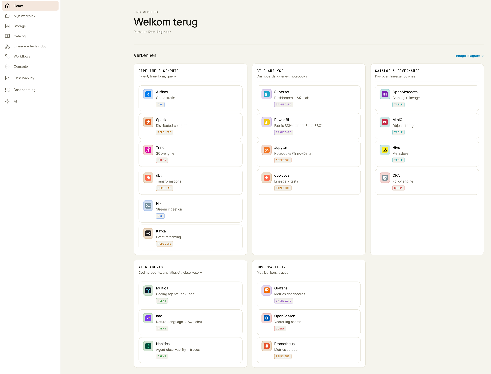

<!-- Auto-generated door scripts/docs_gen.py uit portal/src/data/components.ts.
     Wijzigingen handmatig vervallen bij de volgende CI-build — bewerk de TS-bron. -->

# UWV Reference Data Platform

<figure markdown="span">
  { .hero-screenshot }
  <figcaption>De portal-shell — één launchpad voor alle platform-UI's, gegroepeerd per laag.</figcaption>
</figure>

Een **fictieve, illustratieve** referentie-implementatie van een modern data-
en analyticsplatform voor UWV, gebouwd op open source en gericht op compliance
met NORA, AVG, BIO/BIO2, NIS2 en de AI Act.

!!! warning "Geen echte UWV-data"
    Geen echte BSN's, geen echte productiecode. Alle datasets zijn synthetisch
    en gemarkeerd met `# SYNTHETIC DATA — UWV REFERENCE PLATFORM — NOT FOR REAL USE`.
    Deze repo is geen UWV-product en geen aanbestedingsstuk.

## Wat vind je hier?

<div class="grid cards" markdown>

-   :material-sitemap:{ .lg .middle } **Architectuur**

    ---

    20 componenten over 9 lagen — van ingestie
    tot consumptie, met identity, observability en governance als
    cross-cutting lanen.

    [:octicons-arrow-right-24: Open architectuur](architectuur/index.md)

-   :material-account-group:{ .lg .middle } **Voor wie?**

    ---

    12 rollen met elk eigen handleiding: WIA-beoordelaar,
    WW-handhaver, data-engineer, platform-admin, … Toegang en data-zichtbaarheid
    komen uit OPA-policies en Keycloak-rollen.

    [:octicons-arrow-right-24: Bekijk rollen](rollen/index.md)

-   :material-target:{ .lg .middle } **Use cases**

    ---

    12 concrete business-flows — van WIA-funnel (UC-01) tot
    FOCUS FinOps (UC-12) — met scope, CGM-entiteiten, doelbinding
    en AI-Act-classificatie.

    [:octicons-arrow-right-24: Bekijk use cases](use-cases/index.md)

-   :material-clipboard-text:{ .lg .middle } **Beslissingen**

    ---

    11 ADRs leggen de fundamentele keuzes vast: Stackable, Delta vs Iceberg,
    OPA als Trino-authz, OpenMetadata als catalog, dbt-trino als
    transformatielaag, NetworkPolicies en Entra-brokering.

    [:octicons-arrow-right-24: Bekijk ADRs](adr/index.md)

-   :material-shield-check:{ .lg .middle } **Compliance**

    ---

    Iedere R-NORA/AVG/BIO/NIS2/AI-Act-requirement is gemapt op een concreet
    bestand of setting — herleidbaar in code en config.

    [:octicons-arrow-right-24: Compliance-mapping](compliance-mapping.md)

-   :material-cog:{ .lg .middle } **Operations**

    ---

    Runbook, security-policy, documentatie-gaps, roadmap. De operationele
    realiteit van het platform.

    [:octicons-arrow-right-24: Operations](runbook.md)

</div>

## Snelstart

```bash
# Voorvereisten: Docker Desktop (≥ 8 GB / ≥ 4 CPU), k3d ≥ 5.6, kubectl, helm, stackablectl

git clone https://github.com/fresh-minds/FreshStackableDataPlatform.git
cd FreshStackableDataPlatform

# DNS-injectie voor lokale toegang
echo "127.0.0.1 keycloak.uwv-platform.local \
  superset.uwv-platform.local airflow.uwv-platform.local \
  minio.uwv-platform.local openmetadata.uwv-platform.local" | sudo tee -a /etc/hosts

# Cluster + platform deployen (~15-30 min op de eerste run)
make cluster        # k3d cluster create
make bootstrap      # cert-manager, MinIO, Postgres, Keycloak, Stackable operators
make deploy-platform # Trino, Spark, Airflow, Superset, OpenMetadata
make seed           # synthetische data laden (10k cliënten)
make test           # smoke tests
```

## Wat is de stack?

| Laag | Component | Kort |
|---|---|---|
| Identiteit | **Keycloak** | OIDC, MFA, rol-claims |
| Ingestie | **Spark Structured Streaming** | Leest JSONL uit de S3 raw-zone → Delta (NiFi/Kafka als template, operators uit) |
| Opslag | **MinIO + Hive Metastore** | S3-compatible, Delta-tabellen, catalog |
| Verwerking | **Spark (Stackable)** | Structured Streaming + batch |
| Query | **Trino + OPA** | SQL over lakehouse met policy-checks |
| Transformatie | **dbt-trino** | Staging → intermediate → marts, format-agnostisch |
| Orkestratie | **Airflow** | DAGs voor batch + dbt-runs |
| BI | **Superset** | Dashboards + SQL Lab |
| Governance | **OpenMetadata** | Catalog, glossary, lineage, DQ |
| Observability | **Vector → OpenSearch + Prometheus + OTEL** | Logs, metrics, traces |

Alle componenten via **Stackable Data Platform 26.3** operators.

## Bijdragen

Issues, PR's en feedback welkom via [GitHub](https://github.com/fresh-minds/FreshStackableDataPlatform).
Een nieuwe doc volgt de bestaande structuur (ADR ↔ use-case ↔ handleiding);
kruisverwijzingen worden bijgewerkt in dit document én in de index.
